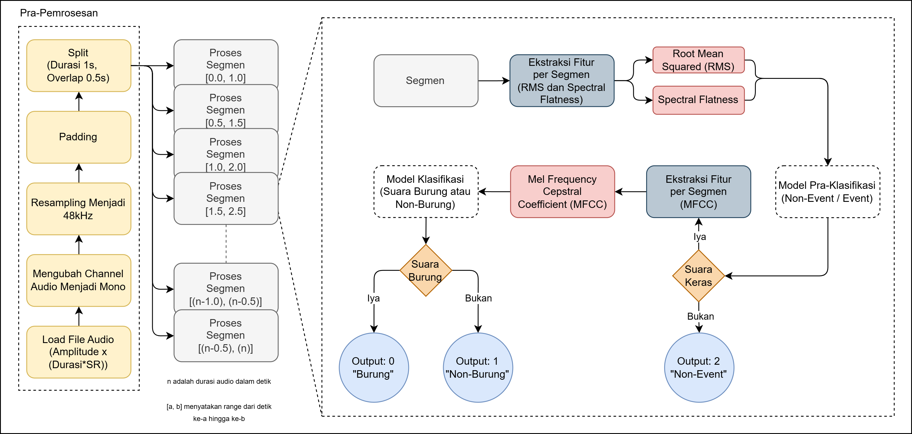
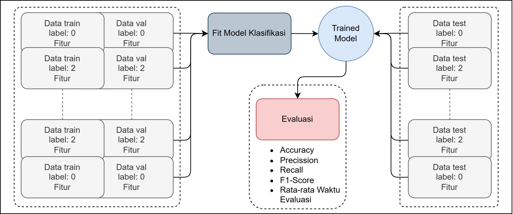

# Tugas Besar Mata Kuliah Dasar Kecerdasan Artificial

 

  
 
  

## 📝 Deskripsi Proyek  
Repository ini dibentuk untuk memenuhi tugas besar mata kuliah Dasar Kecerdasan Artificial (DKA) Telkom University 2025 dengan implementasi:  
- Sistem Inferensi Fuzzy Mamdani  
- Sistem Inferensi Fuzzy Sugeno  
- Analisis perbandingan performa kedua metode  

## 📚 Kelengkapan Dokumen
| Dokumen | Link |
|---------|------|
| Proposal | [Proposal_Tugas-Besar.pdf](Proposal_Tugas-Besar.pdf) |
| Laporan Final | [Laporan_Tugas-Besar.pdf](Laporan_Tugas-Besar.pdf) |
| Presentasi | [PPT_Tugas-Besar.pdf](PPT_Tugas-Besar.pdf) |

## 👥 Anggota Kelompok
- M. Rifqi Dzaky Azhad / 103012330009
- Fathan Arya Maulana / 103012300083

## 🗃️ Dataset
Sistem menggunakan data audio dari sumber berikut:
- [🔊 Kaggle Noise Audio Dataset](https://www.kaggle.com/datasets/javohirtoshqorgonov/noise-audio-data)  
- [🎵 Xeno-Canto Bird Sounds](https://xeno-canto.org)  

## ⚙️ Alur Sistem
### Proses Inferensi
  
*Diagram alur proses inferensi fuzzy*

### Proses Training
  
*Diagram alur pelatihan model*

## 🛠️ Teknologi Digunakan
- Python 3.x
- Scikit-Fuzzy
- Librosa (audio processing)
- Matplotlib (visualisasi)

## 📊 Hasil Eksperimen
*(Tambahkan tabel/gambar hasil perbandingan Mamdani vs Sugeno di sini)*

## 📌 Catatan
Proyek ini dikembangkan antara Maret-Juni 2025. Untuk replikasi, lihat requirements.txt
